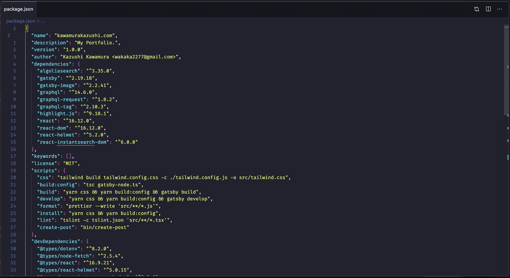

# VSCode Smart Split

Split your editor vertically and horizontally without duplicating files.

## Features



## Commands

```js
"commands": [
{
  "command": "smart.split.vertical",
  "title": "Smart Split Vertically"
},
{
  "command": "smart.split.horizontal",
  "title": "Smart Split Horizontally"
}
]
```
